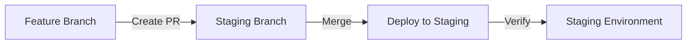
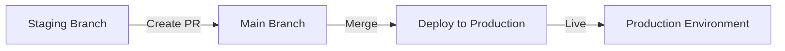

# CI/CD Workflow Guide

This document explains the complete CI/CD workflow for deploying to staging and production.

## Branch Strategy

```
main (production)
  ↑
  PR
  ↑
staging
  ↑
  PR
  ↑
feature branches
```

## Deployment Flow

### 1. Feature Development → Staging



**Steps:**
1. Create a feature branch from `staging`
2. Make your changes
3. Create a PR to `staging` branch
4. GitHub Actions runs terraform plan
5. Review the plan in PR comments
6. Merge PR to trigger staging deployment

### 2. Staging → Production



**Steps:**
1. After staging is verified, create PR from `staging` to `main`
2. GitHub Actions runs terraform plan for production
3. Review the plan carefully
4. Merge PR to trigger production deployment

## Detailed Workflow

### Step-by-Step: Feature to Staging

```bash
# 1. Create feature branch from staging
git checkout staging
git pull origin staging
git checkout -b feature/add-new-resource

# 2. Make your Terraform changes
# Edit files in environments/staging/ or modules/

# 3. Test locally (optional)
cd environments/staging
terraform init
terraform plan

# 4. Commit and push
git add .
git commit -m "feat: Add new S3 bucket configuration"
git push origin feature/add-new-resource

# 5. Create PR to staging on GitHub
# Go to GitHub → Pull Requests → New Pull Request
# Base: staging ← Compare: feature/add-new-resource
```

**What happens automatically:**
- ✅ Terraform format check
- ✅ Terraform validation
- ✅ Terraform plan for staging
- 💬 Plan posted as PR comment

**After Review:**
- Merge the PR
- 🚀 Automatic deployment to staging
- 📊 Deployment summary posted

### Step-by-Step: Staging to Production

```bash
# 1. Ensure staging is working correctly
# Test the staging environment thoroughly

# 2. Create PR from staging to main
git checkout staging
git pull origin staging
git checkout -b release/v1.0.0

# 3. Create PR on GitHub
# Base: main ← Compare: staging
```

**What happens automatically:**
- ✅ Terraform format check
- ✅ Terraform validation
- ✅ Terraform plan for production
- 💬 Plan posted as PR comment
- ⚠️ Production warning shown

**After Review:**
- Merge the PR
- 🚀 Automatic deployment to production
- 📊 Production deployment summary

## GitHub Actions Jobs

### On Pull Request to Staging

```yaml
Jobs:
1. terraform-validate
   ├─ Checkout code
   ├─ Setup Terraform
   └─ Format check

2. terraform-plan-staging (depends on: validate)
   ├─ Configure AWS credentials
   ├─ Terraform init
   ├─ Terraform validate
   ├─ Terraform plan
   └─ Comment plan on PR
```

### On Merge to Staging

```yaml
Jobs:
1. terraform-apply-staging
   ├─ Terraform init
   ├─ Terraform apply (auto-approve)
   ├─ Get outputs
   └─ Post deployment summary
```

### On Pull Request to Main

```yaml
Jobs:
1. terraform-validate
   └─ Format check

2. terraform-plan-production (depends on: validate)
   ├─ Configure AWS credentials
   ├─ Terraform plan (production)
   └─ Comment plan on PR with warning
```

### On Merge to Main

```yaml
Jobs:
1. terraform-apply-production
   ├─ Terraform init
   ├─ Terraform apply (auto-approve)
   ├─ Get outputs
   └─ Post production summary
```

## Environment Protection

### Staging Environment
- Automatically deploys on merge to `staging`
- No manual approval required
- Suitable for testing and validation

### Production Environment
- Automatically deploys on merge to `main`
- Consider adding manual approval in GitHub settings
- Critical infrastructure changes

## Adding Manual Approval

To add manual approval for production:

1. Go to Repository Settings
2. Navigate to Environments
3. Select `production`
4. Enable "Required reviewers"
5. Add team members who must approve

## Rollback Procedure

### To Rollback Staging

```bash
# Method 1: Revert the commit
git revert <commit-hash>
git push origin staging

# Method 2: Use previous state
cd environments/staging
terraform state pull > backup.tfstate
# Restore previous configuration
terraform apply
```

### To Rollback Production

```bash
# Create rollback PR
git checkout main
git revert <commit-hash>
git checkout -b rollback/production
git push origin rollback/production

# Create PR: main ← rollback/production
# Merge to trigger deployment
```

## Monitoring Deployments

### View GitHub Actions

```
Repository → Actions → Terraform CI/CD Pipeline
```

You can see:
- All workflow runs
- Deployment status
- Job logs
- Artifacts (terraform plans)

### View Deployment Summaries

After each deployment, check:
- GitHub Actions run summary
- S3 bucket names
- Lambda function names
- Test commands

### AWS Console

Check deployed resources:
- S3 buckets with correct tags
- Lambda functions running
- CloudWatch logs for Lambda executions

## Best Practices

### Before Creating PR

- [ ] Run `terraform fmt` locally
- [ ] Run `terraform validate` locally
- [ ] Run `terraform plan` locally
- [ ] Review the plan output
- [ ] Write clear commit messages

### When Reviewing PR

- [ ] Check the terraform plan output
- [ ] Verify resource changes make sense
- [ ] Ensure no unintended deletions
- [ ] Check tags are correct
- [ ] Confirm environment matches branch

### After Deployment

- [ ] Verify resources in AWS console
- [ ] Test functionality
- [ ] Monitor CloudWatch logs
- [ ] Check costs in AWS Cost Explorer

## Troubleshooting

### Plan Fails on PR

1. Check the error in PR comments
2. Fix the issue locally
3. Push new commits
4. Plan runs automatically

### Apply Fails on Merge

1. Check GitHub Actions logs
2. Check AWS CloudWatch
3. Verify AWS credentials
4. Check for resource conflicts

### State Lock Issues

```bash
# View current locks
aws dynamodb scan --table-name terraform-cicd-demo-locks

# If stuck, force unlock
terraform force-unlock <LOCK_ID>
```

## Manual Override

You can manually trigger deployments:

```
Actions → Terraform CI/CD Pipeline → Run workflow

Select:
- Branch: staging or main
- Environment: staging or production
```

## Example PR Flow

### Example 1: Adding New S3 Bucket to Staging

```bash
# Create feature branch
git checkout -b feature/new-s3-bucket staging

# Edit environments/staging/main.tf
# Add new module block

# Push and create PR
git push origin feature/new-s3-bucket

# GitHub Actions will:
# 1. Run plan
# 2. Show what will be created
# 3. Post comment on PR

# After merge:
# 1. Auto-deploy to staging
# 2. Get bucket name from summary
# 3. Test the bucket
```

### Example 2: Promoting Staging to Production

```bash
# After staging is verified
git checkout staging
git checkout -b release/add-s3-bucket

# Create PR: main ← staging

# GitHub Actions will:
# 1. Run production plan
# 2. Show production changes
# 3. Add warning to PR

# After merge:
# 1. Auto-deploy to production
# 2. Verify in AWS console
# 3. Monitor for issues
```

## Quick Reference

| Action | Branch | Trigger | Result |
|--------|--------|---------|--------|
| PR to staging | feature → staging | Pull Request | Plan staging |
| Merge to staging | staging | Push | Deploy staging |
| PR to main | staging → main | Pull Request | Plan production |
| Merge to main | main | Push | Deploy production |
| Manual run | any | workflow_dispatch | Choose env |

---

Need help? Check the [README](README.md) or [Quick Start](QUICKSTART.md)
